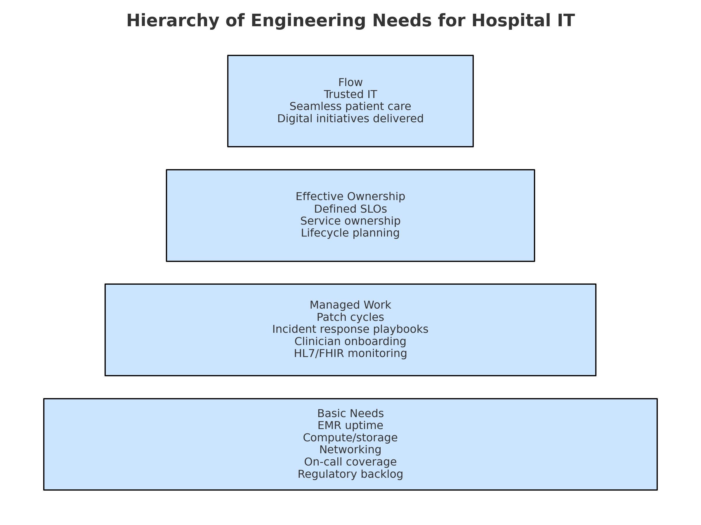
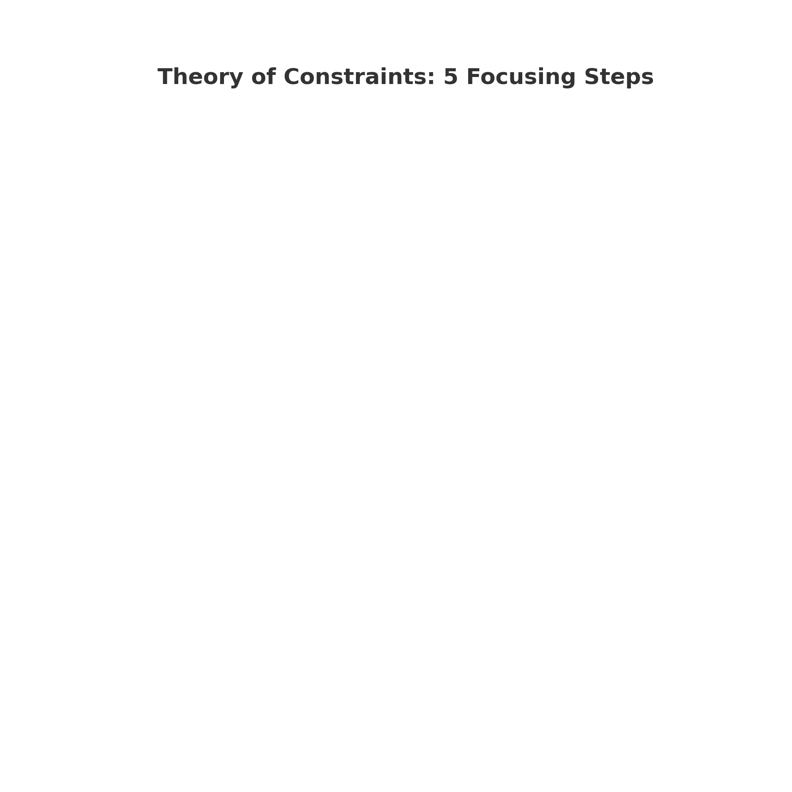

## Monday Morning, 8:03 a.m.

The EMR freezes during morning rounds. Clinicians are locked out. Patients wait. Your phone lights up with texts from the Chief Medical Officer: "What's happening? How long?"

In the IT command channel, the theories fly:

- "SQL Server is thrashing tempdb again — deadlocks are spiking."
- "SAN latency went red — storage headroom is gone."
- "Active Directory token refresh failed; half the Citrix sessions are invalid."
- "We need to double the VDI hosts — remote access is maxed."
- "If this were on Aurora or CosmosDB, we wouldn't be dealing with this."

A vendor chimes in: "Buy our AIOps platform — it would have predicted this outage."

They're all technically valid. But as CIO, you ask yourself: **Which one matters most right now?**

That's the daily reality: dozens of smart people, dozens of smart fixes — but limited time, budget, and energy.

What if you had a way to cut through the noise and consistently identify the single constraint that, if fixed, moves the whole system forward?

## The Model That Cuts Through the Noise

Engineering leaders call it the **Hierarchy of Engineering Needs (HoEN)**. Think of it as Maslow's hierarchy for IT. Before you dream of "flow," you must shore up the basics.

Here's how it maps to a hospital IT department:

### Flow (Top Level)
- Trusted IT that clinicians rely on
- Seamless patient care workflows
- Digital initiatives delivered smoothly

### Effective Ownership
- Defined SLOs for critical systems
- Clear service ownership across teams
- Lifecycle planning for legacy systems

### Managed Work
- Regular patch cycles for all systems
- Tested incident response playbooks
- Repeatable clinician onboarding
- HL7/FHIR interface monitoring

### Basic Needs (Foundation)
- EMR uptime and reliability
- Core compute and storage capacity
- Network stability and performance
- On-call coverage and staffing
- Regulatory compliance backlog

**The insight**: if your basic needs (uptime, compute, people) aren't met, chasing "flow" is a distraction.

## Why Only One Thing Matters

The **Theory of Constraints (TOC)** explains why. In any complex system, one constraint throttles throughput more than any other. Fix that, and the entire system improves.

Goldratt's Five Focusing Steps provide the playbook:

1. **Identify the constraint** — maybe it's your patch cycle, maybe it's Citrix capacity, maybe it's HL7 interface fragility.

2. **Exploit it** — squeeze what you can out of current tools and staff.

3. **Subordinate everything else** — stop chasing side projects until the bottleneck is relieved.

4. **Elevate the constraint** — make targeted investment.

5. **Repeat** — because once one constraint is solved, another emerges.

Healthcare CIOs already feel this intuitively. Whether it's EMR downtime, slow imaging turnaround, or delayed clinician onboarding, the system only flows as fast as its narrowest point.

## Where Claude Code Changes the Game

Historically, applying HoEN + TOC meant workshops with sticky notes, spreadsheets, and months of "maturity assessments." Useful, but slow.

Now, there's **Claude Code (CC)**.

Think of CC as your automation analyst:

**Inputs**: EMR downtime logs, patch compliance reports (WSUS/SCCM), vulnerability scans, Citrix session counts, clinician onboarding ticket times.

**Process**: CC applies HoEN + TOC logic to identify the current bottleneck.

**Outputs**: A Primary Constraint Report with one bottleneck, why it matters, and what to do next — written for both executives and IT staff.

**Mini-story**: A CIO assumed the top issue was "lack of dashboards." But CC, analyzing patch cadence and vulnerability scan data, identified **patching lag** as the true constraint: Windows servers and Citrix VDI hosts were 60+ days behind. The CIO shifted focus. Result: reduced ransomware exposure and restored clinician trust, all before investing in more dashboards.

## A Monthly Cadence That Works

Here's what it looks like in practice:

### 1. Collect Signals
EMR uptime % (Epic/Meditech logs), patch compliance reports, Citrix utilization metrics, onboarding ticket times from ServiceNow/Jira.

### 2. Run CC
Feed this data into a YAML/JSON schema. Ask CC to rank constraints.

### 3. Review the Report
See one bottleneck explained in board-level language ("patch lag exposes patient safety risk") plus IT-level specifics (WSUS/SCCM enforcement, VLAN isolation for legacy PACS).

### 4. Act
Launch one Epic or initiative. Put secondary initiatives on hold until the constraint moves.

### 5. Repeat Monthly
The bottleneck will shift — from uptime → patching → onboarding → interface resiliency.

The result? **Alignment**. Executives, clinicians, and IT see the same "#1 constraint" and the same rationale.

## Why This Works in Healthcare IT

Hospitals are among the most complex IT environments on earth. EHR vendors, PACS, LIS, AD/LDAP, Citrix, HL7/FHIR interfaces, cybersecurity overlays, state/federal reporting — all intertwined.

Traditional improvement approaches scatter effort across dozens of initiatives.

**HoEN + TOC + CC gives you discipline and focus:**

**Credibility**: Decisions aren't gut feel; they're grounded in a model.

**Clarity**: Clinicians, IT, and the board all see the same priority constraint.

**Speed**: CC generates reports in minutes. No six-month consulting cycle.

**Resilience**: Solve one constraint at a time → IT stability grows steadily.

## Example Primary Constraint Report

**(As generated by CC, based on sample hospital IT data.)**

### Primary Constraint: Patch Cycle Lag (Managed Work → Cybersecurity)

**Why Now:**
- 70% of Windows Server 2019 instances are >60 days behind
- Citrix VDI hosts are two patch cycles late, leading to repeated CVEs in scans
- PACS viewers are running outdated DICOM libraries
- This creates a high-likelihood ransomware vector with direct patient safety risk

**Proposed Countermeasure:**
- Automate patch rollout via WSUS + SCCM with 30-day SLA
- Isolate legacy PACS viewers on segmented VLAN until patched
- Establish monthly "Patch Tuesday" comms cadence with clinical units to avoid scheduling surprises

**Acceptance Signals:**
- 95% of servers patched within 30 days
- Vulnerability scans show zero repeat CVEs >60 days old
- PACS/radiology validated against vendor baselines by quarter end

**Impact:**
- Cuts ransomware exposure significantly
- Frees IT from manual patch firefighting
- Boosts clinician trust that EMR and imaging won't suddenly fail mid-shift

## Why Work With Me

I've spent 30 years in embedded medical software, where failure isn't an option. I know regulated environments, real-time constraints, and what it means when patient safety depends on code.

I've also worked as an executive and process improver, helping leaders simplify complexity into actionable steps.

And I use Claude Code every day — not just for development, but to automate prioritization, reporting, and decision discipline.

**My offer**: I'll set up the system for you —

- The Hierarchy of Engineering Needs tailored for hospital IT
- A TOC-based cadence (monthly or quarterly) that keeps you focused
- Claude Code automation that turns raw IT metrics into CIO-ready reports

If you're a hospital CIO, this means: **no more "initiative whiplash."** Every month, you'll know exactly what matters most.

## Call to Action

Hospitals can't afford IT drift. With HoEN, TOC, and Claude Code, you can cut through the noise, align stakeholders, and deliver IT clinicians trust.

**👉 Contact me to see what this system would look like for your hospital.**

---

## References & Further Reading

- **Eliyahu Goldratt, *The Goal*** — classic intro to Theory of Constraints
- **Goldratt Institute** — case studies on TOC in healthcare (ER throughput, surgery scheduling)
- **InfoQ Podcast (2025)** — Shane Hastie & Myles Henaghan on the Hierarchy of Engineering Needs
- **HIMSS Reports** — IT governance, cybersecurity resilience in healthcare
- **Case study: Maimonides Medical Center** — used TOC to cut ER length of stay by 20%
- **McKinsey & Forrester** — on LLMs/Claude automating analysis & reporting in enterprises

---

**📞 Call us: (425) 501-9074**  
**✉️ Email: contact@common-sense.com**  
**🌐 Learn more: [Process Automation Solutions](/process-automation.html)**